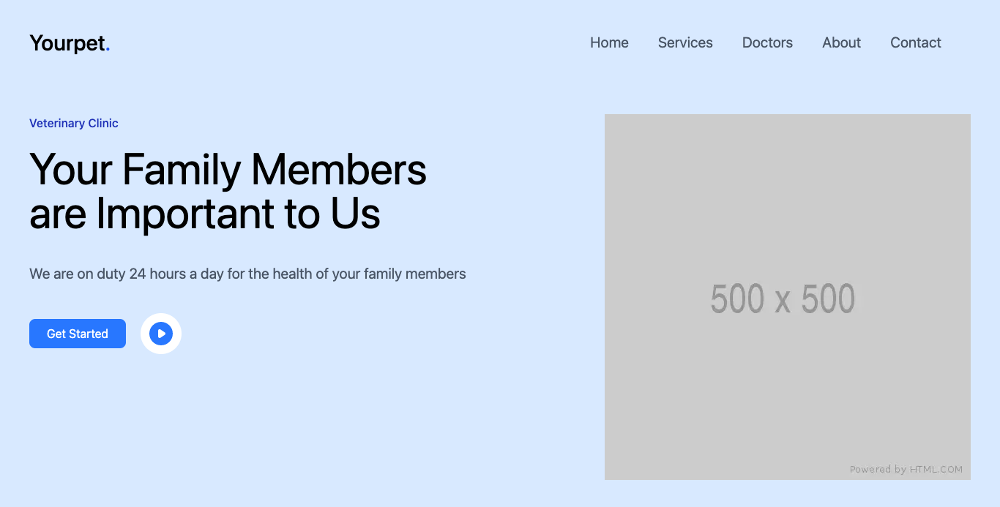

# Your Pet - React.js + Tailwindcss
This is a single page web application built in [React.js](https://reactjs.org) and powered by [Next.js](https://nextjs.org) & [Tailwindcss](https://tailwindcss.com). The concept for the UI came from a post I saw on pinterest by [Caglar Cebeci](https://dribbble.com/shots/15335469-Veterinary-Clinic-Landing-Page/attachments/7094348?mode=media). I have always been a fan of animals, so building a demo landing page for a fictitious Veterinary Clinic is a no brainer. For Hosting im using [Vercel](https://vercel.com) for simplicity.

> [Live Demo]()



## Requirement
- Next.js
- Tailwindcss
- Node.js

## Setup

```
$ git clone git@github.com:conceptcodes/react-your-pet.git
$ cd react-your-pet
$ yarn install
$ yarn dev
```
Open `http://localhost:3000` and enjoy!


Compile and minify for production
```
$ yarn build
```


